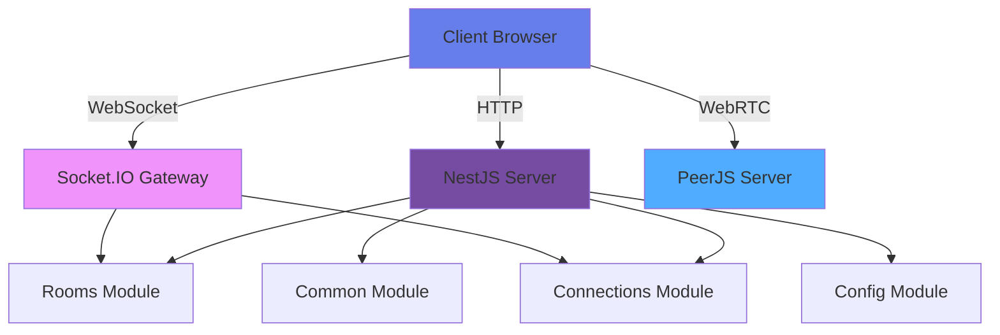

# Zoom Clone with NestJS

A modern video conferencing application built with NestJS, Socket.IO, and WebRTC, featuring a modular architecture for scalability.

## ✨ Features

- 🎥 **Real-time Video Conferencing** - WebRTC-based peer-to-peer video streaming
- 🎤 **Audio/Video Controls** - Toggle camera and microphone
- 👥 **Live Participant Counter** - See who's in the room
- 🎨 **Modern UI** - Beautiful glassmorphism design with responsive layout
- 🔔 **Real-time Notifications** - Join/leave alerts
- 📱 **Mobile Responsive** - Works on all devices
- 🏗️ **Modular Architecture** - Feature-based module organization

## Prerequisites

- Node.js 18+
- npm or yarn

## Installation

```bash
npm install
```

## Running the Application

### Quick Start (Recommended)

The application now integrates PeerJS server, so you only need one command:

```bash
npm run start:dev
```

The application will be available at `http://localhost:3000`

### Production Mode

**Build the application:**

```bash
npm run build
```

**Run the production server:**

```bash
npm run start:prod
```

## How It Works

1. Navigate to `http://localhost:3000` - you'll be redirected to a random room
2. Share the URL with others to join the same room
3. Grant camera and microphone permissions when prompted
4. Your video stream will appear along with other participants
5. Use the controls to toggle video/audio or leave the room

## Architecture



### Technology Stack

- **Backend**: NestJS with modular architecture
- **WebSocket**: Socket.IO for signaling
- **WebRTC**: PeerJS for peer-to-peer connections
- **Frontend**: Vanilla JavaScript with modern UI
- **TypeScript**: Full type safety

## Project Structure

```
├── src/
│   ├── main.ts                           # Application entry point with PeerJS integration
│   ├── app.module.ts                     # Root module
│   ├── app.service.ts                    # Application services
│   │
│   ├── rooms/                            # Rooms feature module
│   │   ├── rooms.controller.ts           # Room HTTP routes
│   │   ├── rooms.service.ts              # Room business logic
│   │   ├── rooms.module.ts               # Rooms module
│   │   └── dtos/                         # Data transfer objects
│   │       ├── create-room.dto.ts
│   │       └── join-room.dto.ts
│   │
│   ├── connections/                      # Connections management
│   │   ├── connections.service.ts        # WebRTC connection tracking
│   │   └── connections.module.ts
│   │
│   ├── events/                           # Socket.IO events
│   │   ├── events.gateway.ts             # WebSocket gateway
│   │   ├── events.module.ts              # Events module
│   │   └── dtos/
│   │       └── join-room-event.dto.ts
│   │
│   ├── common/                           # Shared code
│   │   ├── interfaces/                   # TypeScript interfaces
│   │   │   ├── user.interface.ts
│   │   │   └── room.interface.ts
│   │   ├── exceptions/                   # Custom exceptions
│   │   │   ├── room-not-found.exception.ts
│   │   │   └── room-full.exception.ts
│   │   └── common.module.ts
│   │
│   ├── config/                           # Configuration
│   │   ├── app.config.ts                 # App configuration
│   │   └── config.module.ts
│   │
│   └── domain/                           # Domain models
│       └── models/
│           ├── room.model.ts
│           └── user.model.ts
│
├── public/                               # Frontend assets
│   ├── room.html                         # Room page
│   ├── script.js                         # Client-side logic
│   └── styles.css                        # Modern CSS styling
│
└── .env.example                          # Environment variables template
```

## Modules Overview

### 🏠 Rooms Module

Handles room creation, management, and HTTP routes for room operations.

### 🔌 Connections Module

Manages WebRTC peer connection state and tracking.

### 📡 Events Module

Socket.IO gateway for real-time communications and signaling.

### 🛠️ Common Module

Shared interfaces, DTOs, and custom exceptions used across modules.

### ⚙️ Config Module

Centralized configuration management with environment variable support.

## Available Scripts

- `npm run start` - Start the application
- `npm run start:dev` - Start in development mode with auto-reload
- `npm run start:prod` - Start in production mode
- `npm run build` - Build the application
- `npm run lint` - Lint the code
- `npm run format` - Format code with Prettier

## Environment Variables

Create a `.env` file based on `.env.example`:

```bash
PORT=3000
NODE_ENV=development
PEERJS_PORT=3001
PEERJS_PATH=/peerjs
CORS_ORIGIN=*
```

## Future Enhancements

The modular architecture makes it easy to add:

- 💬 **Text Chat** - In-room messaging
- 📺 **Screen Sharing** - Share your screen
- 🎙️ **Recording** - Record meetings
- 🔐 **Authentication** - User accounts and room passwords
- 💾 **Database Integration** - Persist rooms and user data
- 📊 **Analytics** - Meeting statistics and usage data
- 🔔 **Notifications** - Advanced notification system

## Technologies

- **NestJS** - Progressive Node.js framework
- **Socket.IO** - Real-time bidirectional event-based communication
- **WebRTC** - Peer-to-peer video/audio streaming
- **PeerJS** - Simplified peer-to-peer connections
- **TypeScript** - Typed JavaScript for better development experience

## License

ISC

## Contributing

Contributions are welcome! The modular architecture makes it easy to add new features. Please feel free to submit a Pull Request.
